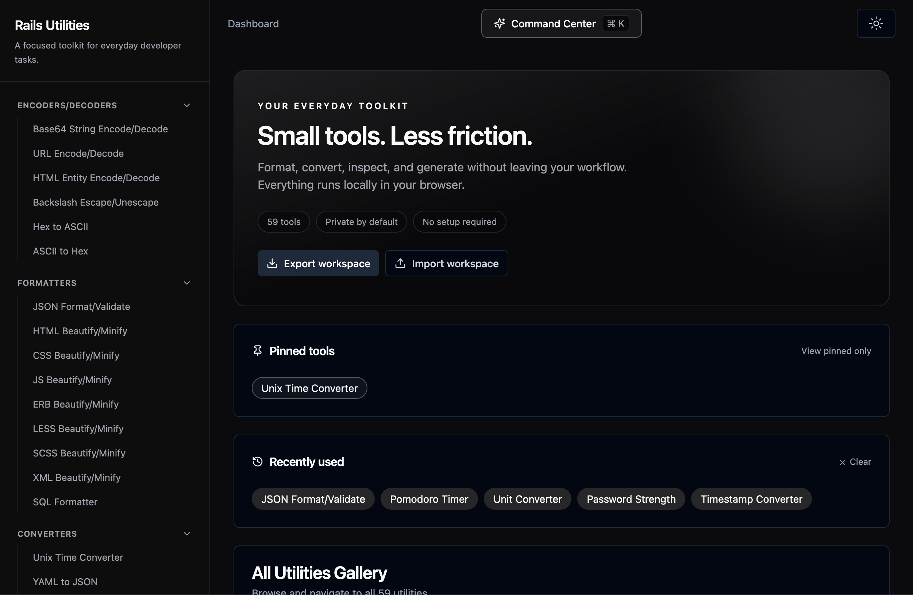
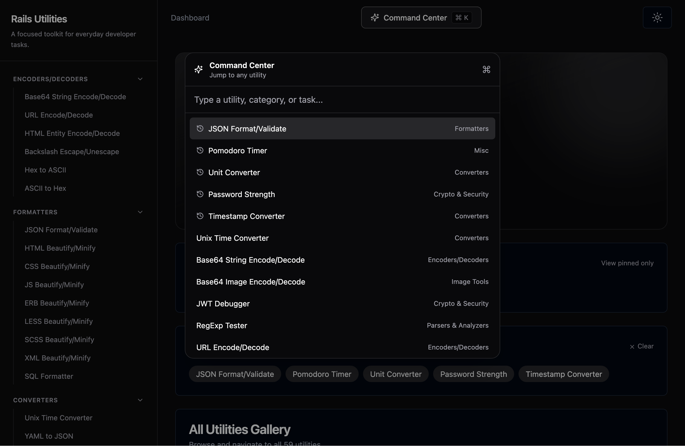

# 🛠️ Rails Utilities: Collection of Utilities

> A comprehensive collection of **60 developer utilities** built with Rails 8, Vue 3, and TailwindCSS 4. All tools run client-side in the browser for privacy and speed.


---

## ✨ Features

- 🔒 **Privacy-first** - All utilities run client-side, your data never leaves your browser
- 🎨 **Dark Mode** - Beautiful dark theme by default
- ⌨️ **Command Center** - Launch any utility instantly with `Ctrl/⌘ + K`
- 📌 **Pinned & Recent** - Pin favorite tools and jump back to recently used ones
- 🧩 **Saved Snippets & History** - Save inputs per tool, with automatic recent history
- 💾 **Workspace Backup** - Export and import snippets, history, and preferences as JSON
- 🚀 **Onboarding** - Personalize your dashboard with your favorite categories on first run
- 📂 **Categorized** - Utilities organized in collapsible categories
- 📱 **Responsive** - Works on desktop, tablet, and mobile
- ⚡ **Fast** - No server round-trips for most operations
- 🔍 **SEO Optimized** - Rich meta tags, Open Graph, Twitter Cards, and JSON-LD for every utility
- 📦 **Installable PWA** - Install to home screen for offline access and app-like experience
- 🧩 **Plugin API** - Extend the app with custom utilities using the plugin system

---

## 🚀 Quick Start

```bash
# Clone the repository
git clone https://github.com/da-vinci-noob/rails-utilities.git
cd rails-utilities

# Install dependencies
bundle install
bun install

# Start the development server
bin/dev
```

---

## 📦 Tech Stack

- **Ruby on Rails 8** - Backend framework
- **Vue 3 + TypeScript** - Frontend framework
- **TailwindCSS 4** - Styling
- **shadcn/ui** - UI components
- **Vite** - Build tool

---

## 🖼️ Screenshots

| Dashboard | Command Center |
|-----------|----------------|
|  |  |

---

## 🧰 Utilities (60 Total)

### 🔐 Encoders/Decoders (6)

- **Base64 String Encode/Decode** - Encode and decode Base64 strings
- **URL Encode/Decode** - Encode and decode URLs
- **HTML Entity Encode/Decode** - Encode and decode HTML entities
- **Backslash Escape/Unescape** - Escape and unescape backslashes
- **Hex to ASCII** - Convert Hex to ASCII
- **ASCII to Hex** - Convert ASCII to Hex

### 📝 Formatters (9)

- **JSON Format/Validate** - Format and validate JSON data
- **HTML Beautify/Minify** - Beautify or minify HTML code
- **CSS Beautify/Minify** - Beautify or minify CSS code
- **JS Beautify/Minify** - Beautify or minify JavaScript code
- **ERB Beautify/Minify** - Beautify or minify ERB code
- **LESS Beautify/Minify** - Beautify or minify LESS code
- **SCSS Beautify/Minify** - Beautify or minify SCSS code
- **XML Beautify/Minify** - Beautify or minify XML code
- **SQL Formatter** - Format SQL queries

### 🔄 Converters (16)

- **Unix Time Converter** - Convert Unix timestamp to date and vice versa
- **YAML to JSON** - Convert YAML to JSON
- **JSON to YAML** - Convert JSON to YAML
- **Number Base Converter** - Convert numbers between bases
- **JSON to CSV** - Convert JSON to CSV
- **CSV to JSON** - Convert CSV to JSON
- **HTML to JSX** - Convert HTML to JSX
- **PHP to JSON** - Convert PHP array to JSON
- **JSON to PHP** - Convert JSON to PHP array
- **PHP Serializer** - Serialize PHP data
- **PHP Unserializer** - Unserialize PHP data
- **SVG to CSS** - Convert SVG to CSS background
- **cURL to Code** - Convert cURL to code snippets
- **JSON to Code** - Convert JSON to code structs
- **Timestamp Converter** - Convert Unix timestamps to dates and back
- **Unit Converter** - Convert length, mass, temperature, and data units

### 🎲 Generators (6)

- **UUID/ULID Generate/Decode** - Generate and decode UUIDs and ULIDs
- **Lorem Ipsum Generator** - Generate Lorem Ipsum text
- **QR Code Reader/Generator** - Read and generate QR codes
- **Random String Generator** - Generate random strings
- **File Generator** - Generate dummy files
- **Secret Generator** - Generate secure secrets

### 🔑 Crypto & Security (6)

- **JWT Debugger** - Decode and debug JWT tokens
- **Hash Generator** - Generate various hashes (MD5, SHA-1, SHA-256, etc.)
- **Certificate Decoder (X.509)** - Decode X.509 certificates
- **Key Pair Generator** - Generate RSA/ECDSA public/private key pairs
- **Password Strength** - Analyze password strength and estimate crack time

### 🖼️ Image Tools (3)

- **Base64 Image Encode/Decode** - Encode and decode Base64 images
- **Image Converter** - Convert images between PNG, JPEG, WebP formats
- **Image Operations** - Resize, rotate, and flip images

### 📄 Text Tools (4)

- **Text Diff Checker** - Compare two texts side by side
- **String Inspector** - Inspect string length, words, characters
- **String Case Converter** - Convert to camelCase, snake_case, etc.
- **Line Sort/Dedupe** - Sort and deduplicate lines

### 🔍 Parsers & Analyzers (5)

- **RegExp Tester** - Test regular expressions with highlighting
- **URL Parser** - Parse URLs into protocol, host, path, etc.
- **Cron Job Parser** - Parse and explain cron expressions
- **Color Converter** - Convert between HEX, RGB, HSL formats
- **ID Analyzer** - Analyze UUID, ULID, ObjectId, Snowflake IDs

### 🌐 Network (1)

- **DNS Lookup** - Perform DNS lookups via Cloudflare DoH

### 📦 Misc (4)

- **HTML Preview** - Live preview HTML code
- **Markdown Preview** - Live preview Markdown content
- **Compression Tools** - Gzip compress and decompress data
- **Pomodoro Timer** - Focus with timed work and break sessions

---

## 🧠 Workspace Features

Beyond the tools themselves, the app remembers how you work:

- **Command Center** (`Ctrl/⌘ + K`) - Fuzzy search by name, description, or category; recently used tools rank first.
- **Pinned tools** - Pin any utility from the dashboard gallery; filter to pinned-only.
- **Recently used** - Automatically tracked and shown on the dashboard.
- **Saved snippets** - Named, per-tool snapshots of inputs and outputs (JSON Format/Validate, Timestamp Converter, Unit Converter).
- **Recent history** - Each integrated tool keeps the last 20 inputs for instant restore.
- **Workspace backup** - Export all snippets, history, and preferences to a JSON file, and import them on any device.
- **First-run onboarding** - Pick your favorite categories once; the dashboard pins suggested tools for you.

All workspace data lives in `localStorage` — nothing is uploaded, no account needed.

---

## 🔍 SEO & Social Sharing

Every utility page is fully optimized for search engines and social media:

- **Rich meta tags** - Unique title, description, and keywords per utility
- **Open Graph** - Rich previews when shared on Facebook, LinkedIn, Discord
- **Twitter Cards** - Large image cards for Twitter shares
- **JSON-LD** - Structured data for `WebApplication` schema
- **Sitemap** - Auto-generated `sitemap.xml` covering the homepage and every utility route
- **Semantic URLs** - Clean paths like `/json-format-validate`

Generate the sitemap:

```bash
bundle exec rake sitemap:generate
```

---

## 📱 Progressive Web App (PWA)

Install Rails Utilities to your home screen for an app-like experience:

- ✅ **Offline Support** - Service worker caches app shell and dynamic content
- ✅ **Install Prompt** - Native "Add to Home Screen" banner
- ✅ **Standalone Mode** - Runs without browser chrome
- ✅ **Theme Colors** - Matches the dark theme
- ✅ **Push Notifications** - Infrastructure ready for future notifications

The PWA automatically caches:
- App shell (HTML, CSS, icons)
- Dynamically loaded utility components
- API responses with network-first fallback

---

## ⚡ Performance Optimizations

- **Code Splitting** - Vendor libraries split into `vendor-vue`, `vendor-ui`, and `vendor` chunks
- **Route Prefetching** - Top 5 most-used utilities prefetched after initial load
- **Lazy Loading** - All 60+ utility components loaded on-demand
- **Optimized Caching** - Long-term caching with content hashes

---

## 🧩 Extending with Plugins

Add your own custom utilities using the plugin API. Registered utilities get a
route via `router.addRoute()` and appear in the dashboard, sidebar, mobile nav
and command palette:

```typescript
import { registerUtility } from '@/lib/pluginApi'

registerUtility({
  id: 100,
  title: 'My Custom Tool',
  description: 'Does something useful',
  icon: 'https://api.iconify.design/lucide:wrench.svg',
  status: 'Beta',
  category: 'Misc',
  createdAt: new Date(),
  component: () => import('@/components/views/MyCustomTool/Index.vue')
})
```

Import the plugin file from `app/frontend/entrypoints/application.js` **after**
the router import so the route is added to an initialised router.

**Generate a utility scaffold:**

```bash
rails utility:generate[MyCustomUtility]
```

See [`docs/EXTENDING.md`](docs/EXTENDING.md) for full plugin API documentation.

**Example custom utility included:** `Text Analyzer (Example)` - demonstrates the plugin API with live statistics.

---

## 🤝 Contributing

Contributions are welcome! Please read [`CONTRIBUTING.md`](CONTRIBUTING.md) for guidelines.

### Quick Links

- 🐛 [Report a Bug](https://github.com/da-vinci-noob/rails-utilities/issues/new?template=bug_report.md)
- 💡 [Request a Feature](https://github.com/da-vinci-noob/rails-utilities/issues/new?template=feature_request.md)
- ⭐ [Star on GitHub](https://github.com/da-vinci-noob/rails-utilities)
- 📖 [Extension Documentation](docs/EXTENDING.md)

Each utility page includes **Report Bug** and **Request Feature** links pre-populated with the utility name.

---

## 🌐 Live Demo

Visit: [https://rails.da-vinci-noob.com](https://rails.da-vinci-noob.com)

---

## 📄 License

MIT License - feel free to use this project for personal or commercial purposes.